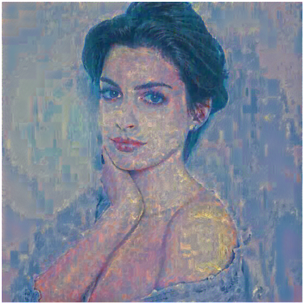

# Neural Style Transfer (image to oil painting)

 Result:
 
 

> reference link: https://pytorch.org/tutorials/advanced/neural_style_tutorial.html

With input images:
 * content image: 
 
 
 * Style image:
 
 
